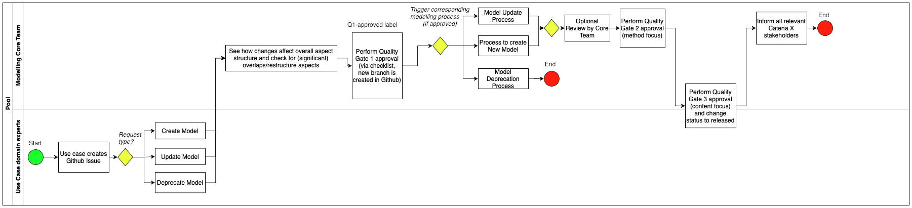
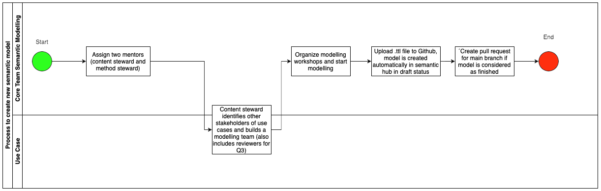
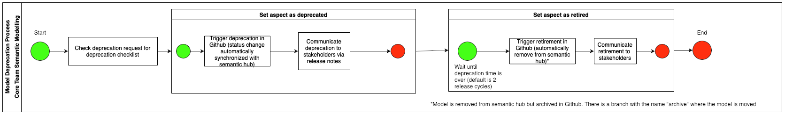

# Aspect Model Governance Process
This repository hosts the Turtle files for the Catena-X Aspect models. These models need to be aligned and agreed upon within and preferably across the use cases in Catena-X. To achieve this agreement and visibility across the whole project, we have a dedicated Governance process enabled within this repository. 

The following page introduces this process and the states in which a model can be. The process is also summarized in this picture: 

## Process
### Roles
The governance process brings together domain and modeling experts. **Domain experts** know their specific use case and bring in requirements regarding data that needs to be consumed and provided as part of the use case. **Modeling experts** are knowledgeable about the modeling approach and have an overview of other already existing models within Catena-X. 
To create awareness of the ongoing model developments and perform joint decisions, we have regular meetings of the "Semantic Layer Modeling Team", which involves everyone interested in Aspect modeling topics around Catena-X. To get 

### Q1 Request for Model
When there is a requirement for a new or modified Aspect model, a domain expert from that use case initiates the modeling process by creating a new issue on GitHub (Tab: Issues -> Button: New Issue or [this link](https://github.com/catenax/BAMMmodels/issues/new/choose)). Depending on the type of request (new model, model update, model deprecation), one may use different templates for the issue.
Based on the information given in the issue description, the modeling team decides whether to approve to progress with the development of this model. In that case, the modeling team assigns the label "Q1-Approved" and names a modeling expert who will support the domain expert in resolving the issue. 

With the Q1 checklist and approval, we want to initiate the exchange between domain and modeling experts in an early development phase. The idea is also to prevent model developers from investing time and effort on solutions for which they will not get an agreement from the modeling team. The discussion of the model modifications shall further create awareness of currently ongoing modeling activities across use cases to avoid duplicate models and development for the same topic. 

### Q2 Valid Model
In the next step, the domain expert and the modeling expert perform the modeling work and create a solution to solve the initial request. This work happens on a dedicated development branch for the new feature. As a result of this phase, the model developers propose the changes by creating a Pull-Request (PR) to commit the content of the new or updated model to the main branch. To create a PR, follow [this link](https://github.com/catenax/BAMMmodels/compare) or select "New pull request" in the "Pull requests" tab. The PR should link the initial issue requesting the changes. 

There is a template for this PR, which contains a checklist of modeling-specific guidelines. It is the task of the modeling expert to check that the proposed model conforms to all items and best practices in the modeling checklist. To indicate the conclusion of the modeling phase and that the model is ready for release and adoption, the modeling experts add the label "Q2-Approved" to the PR.

### Q3 Release Model
The domain expert then asks the use case team from which the initial modeling request originated to approve that the proposed changes fulfill the requirements and that the use case will use it. There is a Q3 checklist in the PR template to guide the approval. This checklist, for example, asks whether there is at least one data provider and one data consumer implementing and using this Aspect. 
There is no specific process for getting the approval for the use case since this strongly depends on its working model size. However, one proven practice is to post the model and visualization in the working space of the use case team and ask for comments during a dedicated review period which could be one week. 
After the approval of the use case, the modeling team checks during one of its meetings that the proposed changes align with the other models in Catena-X and that the model is ready for adoption from a modeling standpoint. 
The discussion of the model also helps the modeling team members to keep track of current modeling activities. If the use case and the modeling team approve the PR, the modeling team assigns the label "Q3-Approved" and merges the PR into the main branch. 

## Labels
To fascilitate the governance in GitHub we use a set of labels as described in the following table: 

| label | description |
----- | -------
Model Update | A request for updating an existing model
New Model | A request for a new model
Deprecate | A request for deprecating an existing model
Q1-Approved | Checklist "Q1 Ready for Development" is approved. When an issue gets this label, a GitHub action automatically generates a new development branch posts a reference in the issue.
Q2-Approved | Checklist "Q2 Ready for Release" is approved.
Q3-Approved | Checklist "Q3 Ready for Production" is approved. The associated pull request can be merged to "main".
Review Required | For this PR or issue a review is requested.
Modeling Team | This issue or PR should be discussed in the modeling team.

## Retiring a model
Once a model gets the status "DEPRECATED" it should not be used anymore by new use cases. Existing applications should look for a way to migrate to an alternative version or model. In alignment with the overall release cycles of Catena-X, the modeling team tags the current main branch with the corresponding Catena-X release and publishes Catena-X modeling release notes. These release notes contain a hint about all model versions that changed the status to "DEPRECATED" since the previous Catena-X release. The modeling team will delete these models  two Catena-X releases cycles later. So use cases are advised to react to the deprecation of models within the next release cycle. 

